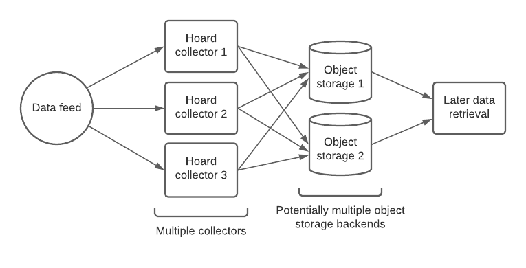

# Hoard

**hoard** _v._ Accumulate (money or valued objects) and hide or store away.

Hoard is an application for collecting data feeds over time. 
Hoard downloads a configured list of feeds periodically (typically every few seconds), 
combines the results for each hour into compressed archive files, 
and then stores these archive files in object storage for later retrieval. 
The application was originally developed to collect New York City subway data, 
and is optimized for feeds whose periodicity is between hundreds of milliseconds and minutes.

One of the key features of Hoard is that it can be run with multiple replicas 
on different machines, 
each autonomously collecting the same data and contributing the results to the 
same object storage. 
This makes the feed collection process resilient to downtime on any machine running Hoard, 
and ensures the resulting data lake is as complete as possible. 
Feed downloads from different replicas are actively de-duplicated,
so there is no additional object storage cost.



## Using Hoard

The Hoard application is compiled by running `go build cmd/hoard.go` in the repository root. 
Alternatively the Docker image `jamespfennell/hoard:latest` can be used.
It just takes a bit of tweaking with Docker volumes to enable it to read the configuration.

Hoard works off a configuration file specifying the feeds to collect and the object 
storage locations in which to store the results.
An [example configuration file](https://github.com/jamespfennell/hoard/blob/master/config/hoard.yml)
can be printed by running `hoard config`.
The following is a simple configuration for collecting weather forecast data for 
Central Park, New York every 5 seconds:

```yaml
workspacePath: /tmp/hoard_workspace  # where to store files locally

feeds:
  - id: us_ny_central_park
    postfix: .json
    url: https://api.weather.gov/gridpoints/OKX/33,37/forecast
    periodicity: 5 seconds

objectStorage:
  - endpoint: nyc3.digitaloceanspaces.com
    accessKey: <access_key>
    secretKey: <secret_key>
    bucketName: weather_bucket
    prefix: forecast
```

The data collection process is run using:

    hoard --config-file path/to/config.yml collector

The Hoard collector typically runs all the time.
It can (and generally should) be run simultaneously on multiple machines,
so that if one Hoard collector stops running temporarily, data collection still continues.
An example of a reason a Hoard collector stops is because the host machine is being restarted
to apply OS updates.
The collector includes an HTTP server that displays the configuration
file and exports metrics in Prometheus format 
([example of a running Hoard collector](https://hoard1.transitdata.nyc)).

After collection, data can be retrieved on any computer using the `retrieve` command:

    Hoard --config-file path/to/config.yml retrieve \
        --start-hour 2021-02-03-00 --end-hour 2021-02-03-00 .

This downloads all the collected data between the specified times 
(format `YYYY-MM-DD-HH`) into the current directory.
Hoard always assumes UTC time.
Note that there is generally a delay of about an hour from when Hoard collects data 
to when it can be retrieved - 
this is because Hoard only stores data for whole hours in object storage.

### Prometheus metrics

The collector process exports a number of Prometheus metrics on the `/metrics` endpoint.
These can be used to monitor the collection process. 
The metrics all begin with the `hoard_` prefix, and are documented in the endpoint. 
The most important ones to track are probably:

- `hoard_download_saved_count` is a counter that records the absolute number of
  successful downloads for each feed. Taking the rate gives the number of 
  successful downloads per minute. 
  This can be used to ensure all the data is being collected.
  
- `hoard_remote_storage_objects_size` is a gauge that records the total size 
  of all data in object storage, per feed. 
  This can be used to verify the expected amount of data is being stored every day.
  
