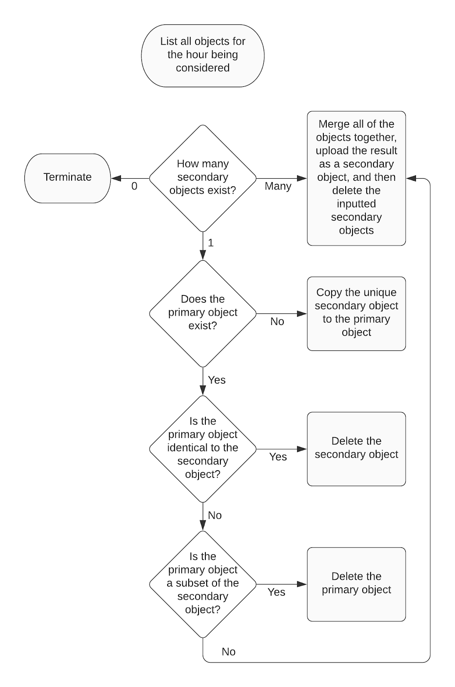

# Hoard design doc

Hoard is an application for collecting data feeds over time to create a data lake.
For each feed of interest, Hoard downloads the feed periodically (typically every few seconds),
bundles the results for each hour into archive files,
and then stores these archive files in object storage for later retrieval.
The application was originally developed to collect New York City subway data,
and is optimized for feeds whose periodicity is between hundreds of milliseconds to minutes.

One of the key features of Hoard is that it can run with multiple replicas,
each tracking the same data feeds and contributing to the same archive files in bucket storage.
This makes the data collection process resilient to downtime on individual nodes running Hoard,
and ensures the resulting data lake is as complete as possible.


## Overview and API

Hoard is a piece of software for collecting data feeds,
storing them in object storage, and retrieving them later.
It runs as both a standalone binary,
and as a Go package that can be used in other Go applications. 

Hoard collects data feeds by running a process that performs four steps:
1. Periodically downloading data feeds to disk,
1. Packaging data for each hour into compressed archive files,
1. Uploading these archive files to object storage,
1. Reconciling the archive files uploaded by different replicas for each hour into one archive for that hour. There are two algorithms that Hoard can run to do this, each with certain tradeoffs.

Any object storage can be used with Hoard, 
although one of the reconciliation algorithms assumes the object storage 
is strongly consistent (currently this includes AWS S3 and Google Cloud Storage).


## Configuring Hoard

Every Hoard instance runs using a Yaml configuration file that contains
information on (1) the feeds to be collected and (2) the object storage to store the data in.
This is an example of the configuration file Hoard uses:

```
feeds:
  - id: feed_id
    url: https://www.example.com/path/to/feed
    headers:
      x-special-header-key: special_header_value
    periodicity: 5s
    postfix: .txt

  - id: second_feed_id
    # ...

object_storage:

  - id: main
    prefix: a_string_that_is_placed_at_the_beginning_of_every_object_key
    reconciliation_algorithm: hashed  # or 'primary'; see below
    region_name: TODO
    endpoint_url: TODO
    aws_access_key_id: TODO
    aws_secret_access_key: TODO
    bucket: TODO
    service_name: TODO

  - id: secondary
    #...

```

Hoard interprets the configuration as a Go template.
A map of all the current environment variables (to their values)
is provided as data.
With this approach the configuration can be made publicly available
(and thus easy for Hoard replicas to obtain) 
without making confidential data like object storage credentials public. 
Such confidential data can be injected into the template through environment variables.


## Running Hoard

Hoard runs as both a single binary and as a Go package that can be used in other applications.
The binary is actually a thin wrapper around the package,
and its API corresponds closely to the package's API.

The command and the package's API accept a number of following options
independently of the task being performed.
The command accepts these options using command line flags; 
the package accepts them as function arguments. 
These general options are:

- `config_url` - the URL to get the configuration from. 
    This is the preferred method for obtaining the configuration as multiple 
    replicas can have the same source of truth.
- `config_file` - if a config URL is not provided, the local place on disk to get the config from.
- `workspace` - the path to a local base directory that Hoard can use for storing temporary files.

### Collect

The collect task is the core of Hoard; it performs the actual collection and storage of data.
Running the task starts a process that runs until forced to stop.
The task accepts additional options:

- `monitoring_port` - the port for the monitoring HTTP server to listen on.

### Clean

Clean takes all files that are in the workspace and sends them to object storage.
After running clean, the data is no longer confined to the Hoard replica
and Hoard doesn't need to run anymore.

The clean task automatically runs at the end of the collect task.

### Retrieve

The retrieve task copies files from object storage to the local machine. 
The following additional options are accepted:

-`target_directory`: where Hoard should store the files.
-`start_time`: the beginning of the time period for which one wants the data retrieved. 
    This time is automatically rounded down to the nearest hour.
-`end_time`: the end of the time period for which one wants the data retrieved. 
    This time is automatically rounded up to the nearest hour.
-`feed_ids`: the feeds to retrieve.
-`collapse_feeds `- a boolean that, if true, results in data for different feeds 
    for the same hour to be placed in the same directory.
-`collapse_time` - a boolean that, if true, results in data for different hours 
    to be placed in the same directory. If collapse_feeds and collapse_time are both true, 
    all the data is placed in a single directory.
-`no_extract`: don't extract the archives after retrieving them.
-`object_storage_ids` : which object storage to use for retrieval. 
    Defaults to the first object storage.

### Delete

The delete task removes data files from object storage.

-`start_time`: the beginning of the time period for which one wants the data deleted. 
    This time is automatically rounded down to the nearest hour.
-`end_time`: the end of the time period for which one wants the data deleted. 
    This time is automatically rounded up to the nearest hour.
-`object_storage_ids`: which object storage to delete from. Must be provided.


## The collection process

This section of the design doc details the exact process by which Hoard collects data feeds.

The collection process works in hour-long periods. It has 4 phases:
For each feed, the data feed is periodically downloaded to a directory for that hour and that feed.
After the hour, all of the data for the hour is put in a compressed archive file. The archive is uploaded to object storage
The multiple archives uploaded for the same hour by different replicas are merged together.

### Data feed downloading

Hoard runs with a given base directory `$WORKSPACE`. 
It periodically downloads data feeds and stores them in the directory

    $WORKSPACE/downloads/<feed_id>/<year>/<month>/<day>/<hour>/

with a file name

    <feed_id>_<iso_8610>_<hash><postfix>

where:

- Month, day, year minute, second are all 2 characters long; 
    millisecond 3 characters long, and hour 4.
- The ISO 8610 representation of the time is 
    `<year><month><day>T<hour><minute><second>.<millisecond>`.
- The time is always in UTC.
- Postfix is taken from the feed's Yaml configuration.
- The hash is the first 20 character of the base64 encoding of the Sha256 hash of the file

If Hoard downloads the same file twice in a row, it will skip the second file.

### Archive creation

Every hour the feeds for the previous hour are placed in an archive file in the directory 

    $WORKSPACE/archives/<feed_id>/<year>/<month>/<day>/

With the name

    <feed_id>_<iso_8610 for the hour>_<hash>.tar.gz

Where everything is the same as the previous step, except the
ISO 8610 representation is `<year><month><day>T<hour>`.

### Object storage upload

The archive is uploaded to the object storage with a object key of

    <object_storage_prefix>/<feed_id>/<year>/<month>/<day>/<hour>/<file_name>

### Consolidation process

The final stage of the process is to take the multiple archives
uploaded by different Hoard replicas for each hour and merge them into a single archive.
There are two algorithms to achieve this, each with their own tradeoffs.

The _hashed object algorithm_ is the simplest algorithm and works with all
object storage providers. 
It results in a single archive being created, 
whose key has the same form as an uploaded archive:

    <object_storage_prefix>/<feed_id>/<year>/<month>/<day>/<hour>/<file_name>

Where the file name is

    <feed_id>_<iso_8610 for the hour>_<hash>.tar.gz

The advantage of the hashed algorithm is that it doesn't use too much bandwidth 
in performing the reconciliation, and works with every provider.
Its disadvantage is that the resulting archive does not have a predictable stable key. 
In general, Hoard will be needed to retrieve the object.

The _primary object algorithm_ results in the creation of a single archive
with a key of the same form as the hashed object except the file name is

    <file_name>=<feed_id>_<iso_8610 for the hour>.tar.gz

The main benefit of this algorithm is that the resulting key is predictable and stable.
This makes it possible to link to the object directly from outside of Hoard
(for example, to serve the object on the internet),
or to retrieve the object without using Hoard because the key is easy to construct. 

The algorithm does have some disadvantages.
The underlying object storage must be strongly consistent, and not all providers are.
The algorithm also requires more bandwidth to construct. 

The remainder of this section discusses the implementation of these two algorithms.

### Hashed object algorithm

The hashed object algorithm is straightforward. 
It repeatedly performs the following steps until there is only one object for the hour:

1. Download all archives for the hour.
1. Merge the data in these archives into a single archive, and calculate its hash.
1. Uploaded the merged archive to object storage.
1. Delete all of the archives that were downloaded originally.

It's clear this algorithm will result in a single archive. 
The algorithm's key feature is that all operations are idempotent 
and can be safely repeated without losing any data or without other replicas interfering. 
This works largely because the hash of the archive is in the object's key.

### Primary object algorithm

The primary object algorithm is significantly more complex than the hashed object algorithm.

#### Consolidation algorithm overview
First a high level overview. 
The algorithm starts with the uploaded objects from the upload step. 
Keep in mind that because Hoard is a distributed system, 
uploaded objects from different replicas will not in general appear at the same time. 
These starting objects, 
along with any other non-primary objects created by the algorithm, 
are called secondary objects. 
Secondary objects always have a hash in their object key so it's possible to tell them apart. 

The algorithm repeatedly inspects the objects for a given hour. 
If there are multiple secondary objects, 
it merges these together to create a new secondary object, and deletes the old ones. 
(This is precisely the hashed object algorithm.) 
Eventually there will be only one secondary object, 
which is a candidate to be the primary object.
 It will then be copied to the primary key. 

At a later stage more secondary objects may appear
 (for example, a delayed upload from one of the replicas). 
 There is then a delicate arrangement of operations 
 to ensure this new secondary object can be incorporated into the primary object, 
 without accidentally losing data. 
 This turns out to be tricky because without transtasks, 
 overwriting the primary object is inherently dangerous. 
 Deleting secondary objects is safe because their hash is in the key:
 we know exactly what data we are deleting. 
 The primary object does not have this property. 
 If a race condition occurs,
  he primary object may change after a replica has decided to delete it, 
  but before the replica has deleted it. 
  The replica will then delete the wrong data, and potentially create data loss.

To resolve this issue, let's get more detailed. 

#### The decision tree

The consolidation algorithm consists of a decision tree that is repeatedly 
executed by each replica until the termination task is reached.



Every iteration of the decision tree involves evaluating preconditions
and then performing a single task.
The first important observation is that for each task,
assuming its preconditions hold over the whole iteration,
there is no possibility of data loss. 
For example, the "delete the secondary object" task takes place only if 
the data in the secondary object has already been incorporated into the primary object,
in which deleting the secondary object is safe.

Unfortunately, cycles do not occur in transtasks - 
transtasks aren't available on object storage - and so as we're performing an task 
we have no guarantee that the preconditions still hold. 
For example, when performing the task "delete the secondary object" a
 race condition may result in the primary object being deleted at the same time.

However, we can in fact design the system so that each task
will not result in data loss _even if the preconditions no longer hold_.
This makes it safe to perform the tasks concurrently and without any synchronization.
To see this, we will examine each task individually.

- The merge task finishes with data deletion, after the merged archive has been uploaded. 
    This cannot result in data loss, because the merged archive which has 
    just been uploaded contains all of the data in the inputted files. 
    What if another replica concurrently deletes the just-uploaded merged
    archive before the task concludes? 
    This is safe because of transitivity. 
    The other replica was performing an task 
    (either another merge, or a "delete secondary object") 
    which resulted in the data in the merged archive being stored in another location
    (a new distinct merged archive or the primary archive, respectively).
    In this case all of the input data is in the even newer archive.
    
- The "copy unique secondary object to the primary object" doesn't delete any data so
    cannot cause any data loss.
    
- The "delete the secondary object" operates under the assumption that a
    direct copy of itself is in the primary object and assuming the primary object
    doesn't change the task is safe.
    Again, if the primary object is changed due to a concurrent "delete the primary object",
    transitivity still implies that data is safe.
    That task will have only operated under the precondition that a strictly
    larger secondary object exists that contains the primary objects data.
    The strictly larger condition is key: it means that this new archive cannot
    be the archive we are currently deleting.
    
- Finally, we look at the "delete the primary object" task. 
    Assuming that the primary object we delete is the same primary object
    we inspected in the preconditions phase,
    this task is safe because the data is in a strictly larger secondary archive.
    A transitivity argument similar to those above shows that if this strictly larger
    archive is concurrently deleted, it must be because there is another archive which
    contains the data, and so.
    However, the stated assumption is actually not true in general.
    Due to race conditions, it could be the case that the primary archive we delete
    contains different data than we inspected in the preconditions phase,
    and deleting this data may result in data loss.
    This is the key way in which the primary object differs from the secondary object:
    because its key doesn't contain a hash of its contents, we can in general
    not be sure of what it contains.
    To remedy this, we introduce a subsystem that will enable the algorithm to
    satisfy this assumption and thus make the algorithm correct.

#### Primary object assumption making

We want to be able to assume that when we delete a primary object in the 
"delete the primary object task",
that the object we delete is the same as the object inspected in the preconditions phase.
This is solved by introducing time delays which is slightly inelegant but
in practice perfectly tolerable because Hoard is not a low latency system.

Specifically, we alter the "copy the unique secondary object to the main object"
task so that before copying the main object it waits a fixed amount of time,
which for concreteness we take to be five seconds, checks that the state of the hour's 
objects hasn't changed, and then copies the object.
Note that this task is the only task that updates the primary object. 
Thus, with this in place, the system has the following property: 
if the primary object is changed, 
there is a five second period in the middle in which the primary object doesn't exist. 

There is a theoretical possibility that in the intervening period,
a different primary object appears and disappears again - 
we check after the 5 seconds that the state hasn't changed, 
in order to rule this out. 
This works because the total amount of data in the directory uniquely 
defines the primary object to be written. 
A different primary object being created, 
or the same primary object being deleted, 
implies a change to the total amount of data the state, 
which will reflected in the list of all objects for the hour.

With this feature, the system can satisfy the assumption that the primary 
object doesn't change between precondition and task.
This is done by simply setting up a background process which polls the bucket every second. 
If the state of the bucket changes, or the polling fails,
we conservatively assume the primary object has changed and then we can restart the cycle.


## Monitoring and logging

The Hoard collection process launches an HTTP server to provide monitoring pages. 
For version 1, it just stores monitoring data in memory. 
Data is stored for a configurable number of hours.

The home page shows a snapshot of each feed showing at a high level whether it is succeeding or failing:
- Downloading: success latency over the last hour and all time
- Archiving: time since last successful archive, and number of successful archives over all time.
- Uploading and consolidation: same as archiving. 

Each individual feed's page shows:
- Downloading: graph of the download success latency, with the target latency drawn as a horizontal line.
- Archiving: simple log showing the last N archive tasks
- Uploading: simple log showing the last N upload tasks.
- Consolidation: a detailed log that shows each cycle of the consolidation algorithm, 
    the time stamp, and what this replica did.

## History

Hoard is an evolution of a Python application,
somewhat strangely entitled "realtime aggregator", 
that was written in the spring of 2018 to solve the same data collection problem.
Realtime aggregator had a similar architecture to Hoard:
it periodically saved data feeds to disk, created hourly archives,
and then uploaded these to object storage. 
It also supported multiple replicas, at least in theory. 

The Python application was run for over two years gathering NYC subway data, 
but the data was never used,
largely because the app provided no easy way of getting the data out of object storage.
Eventually the source data feeds were moved to different URLs causing the feed
collection process to fail, 
and the system being so difficult to run and configure meant it was just easier just to stop it.
The data was eventually deleted.

This design of Hoard presented in this document is intended to address the deficiencies 
of realtime aggregator. It particularly addresses the following:

- Difficulty running and configuring. Realtime aggregator was run as a collection 
    of four different Python commands invoked periodically by Cron. 
    It was configured via a Python script that was dynamically imported at runtime. 
    All of this meant it was exceedingly difficult just to get the software running. 
    By comparison, Hoard will be run by starting a single Docker image and 
    referencing a public yaml config file on the internet.
    
- Poor support for replication. Replication was possible for realtime aggregator, 
    but it was complicated to set up. 
    The algorithm for reconciling archives in object storage was racy, 
    so the process involved having the algorithm be invoked by different 
    replicas at different minutes in the hour (configured using Cron).
    With Hoard, the racy algorithm has been replaced by a consensus algorithm of sorts, 
    and multiple replicas can be started with no special configuration.
    
- No monitoring. It was impossible to tell if realtime aggregator was actually working!
    There were logs in protobuf format but, unsurprisingly, 
    there was no way to actually get current information from these logs. 
    Hoard will export an HTTP server that will have monitoring data on it.

## Possible future work

- Add support for the bzip2 compression format in addition to gzip. 
    The bzip2 format has a different performance characteristic than gzip 
    - it takes up more CPU, which makes the node running Hoard more expensive, 
    but results in smaller archives, which makes the object storage bandwidth cheaper.
    
- Add the ability to shut down the collection process through HTTP. 
    The HTTP port would be different to the monitoring port so that the monitoring 
    page can be safely exposed on the internet.
    
- Add the ability to reload the configuration.

- Save monitoring data on disk (in a logs subdirectory of the workspace),
    and reload this data on startup. 
